- 拓扑：  
  ​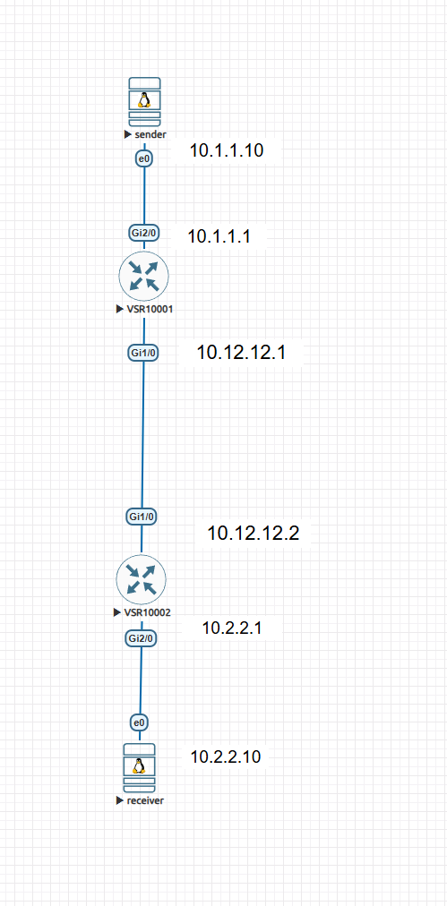
- 打通单播：  
  ​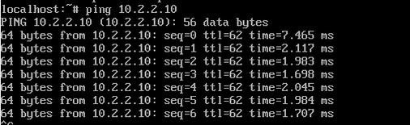
- 开启路由组播功能：

  - R1：

    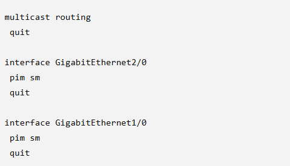

  - R2：  
    ​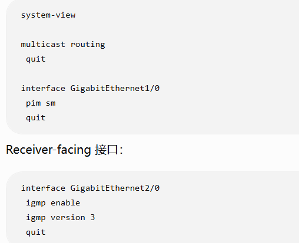
- Linux receiver使用igmpv2进行交互

  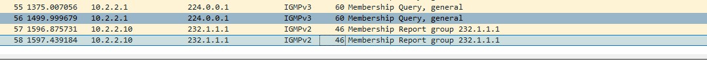
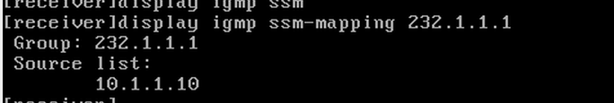

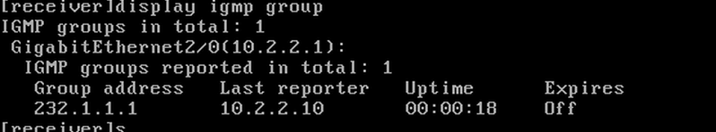
- 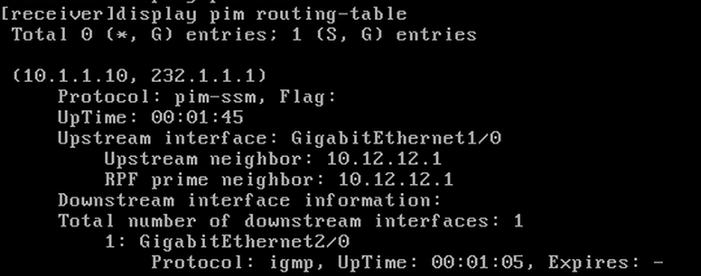

  这时候我们的组播源232.1.1.0是在默认的default的232.0.0.0/8的范围内，可以看到mapping成功生效，即使receiver发送的igmp是v2版本的，没法携带source。通过mapping功能还是成功提供了ssm的服务

### 对比试验：假设组播源不在默认范围内 设为230.30.106.1

- 把sender改为230.30.106.1  
  ​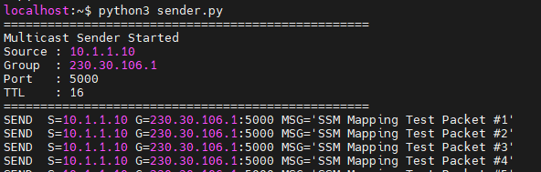
- 把recevier想加入的也改为230.30.106.1  
  ​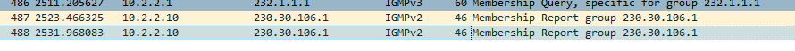
- 在修改前地址范围前：可以看到这里即使有mapping。却没有生效，仍然是sm

  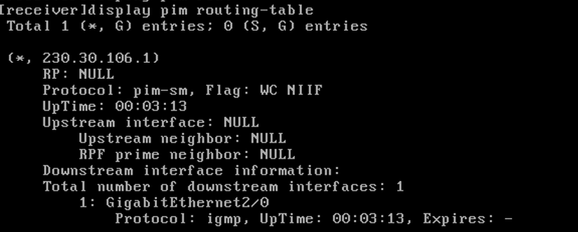
- 修改地址范围之后：  
  ​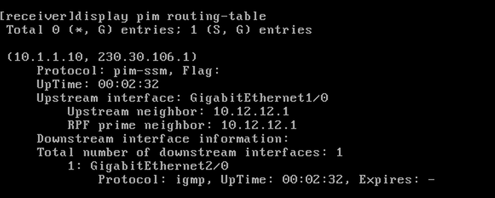

  可以验证到mapping成功生效，服务类型变为ssm，并正确指定了源地址。
- 注意：ssm-policy也就是ssm的**服务范围修改要在整个pim的域内修改**（在这次实验里面就是R1，R2），也就是参加pim的所有路由器。否则无法正常识别。
- 也就是说：**SSM Mapping 是边缘功能，SSM Range 是域级属性**

‍