### 第一步：直连链路连通

- 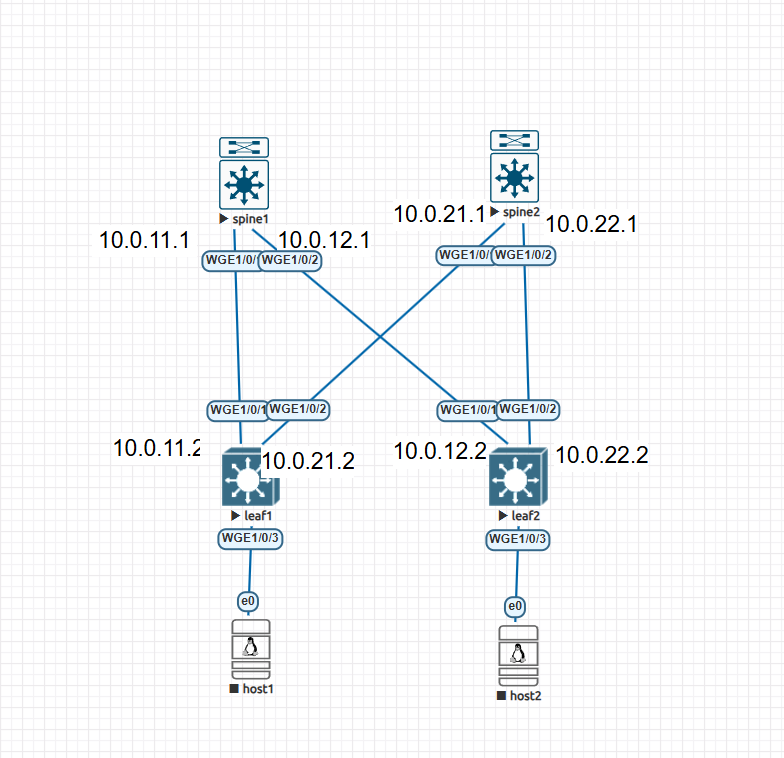
- 在如上图所示的八个接口配置好ip地址，保证spine-leaf之间基础的直连链路可以相互ping通

### 第二步：配置OSPF（Underlay承载网络）

- 创建loopback

  - loopback0：用作router id
  - loopback：用作VXLAN隧道端点地址

  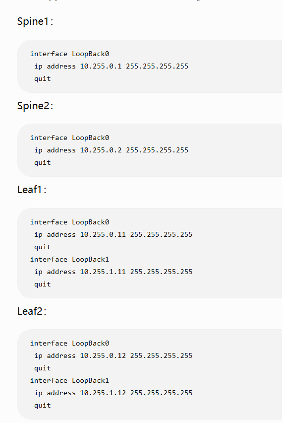
- 配置ospf

  - 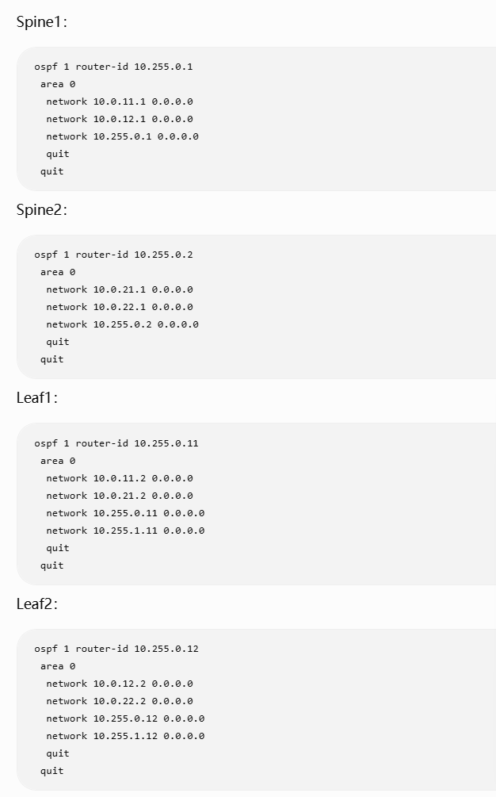
  - 形成等价路径：通过spine1和spine2的路径等价  
    ​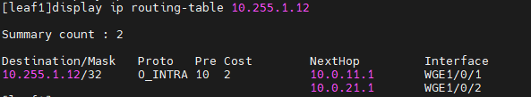
  - 此时已经具备双向通信能力：  
    ​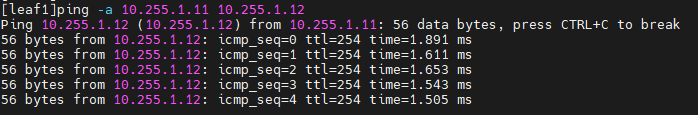

### 第三步：手工VXLAN（Overlay二层网络）

- 在两台leaf上创建VXLAN隧道：  
  ​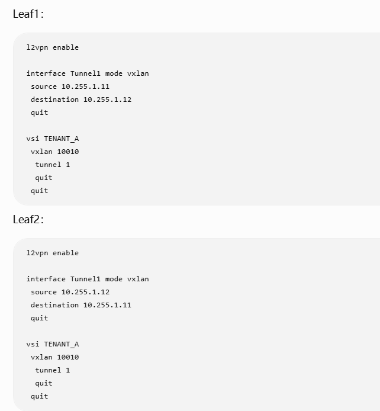
- 把主机接口关联到VSI：  
  ​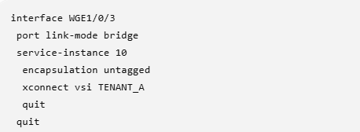
- 配置linux服务器ip地址：

  - 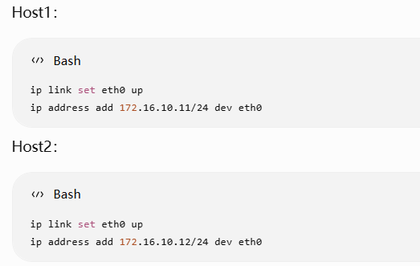
- 在leaf上抓包可以观察到VXLAN报文：  
  ​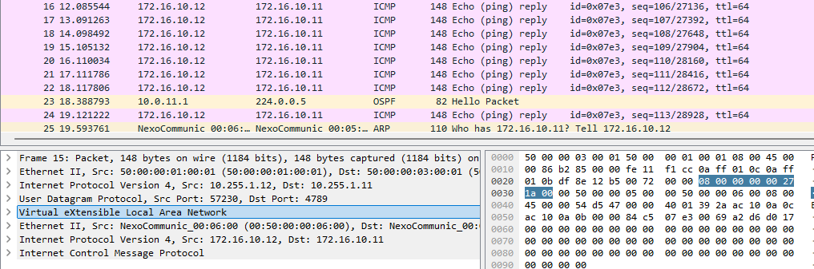
- ### 过程分析：

  - 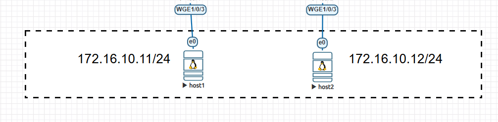

  1. host1分析ip地址，认为host2与自己在同一个网段，应该直接通过二层找到它。但是两台主机之间实际上隔着三层网络，普通路由转发不会把ARP广播报文传递给host2;
  2. 因此，需要把主机原来整个以太网帧，当作载荷装进一个新的UDP/IP报文，外层IP负责穿越三层网络，到达对端以后再拆掉；
  3. 报文结构：  
     ​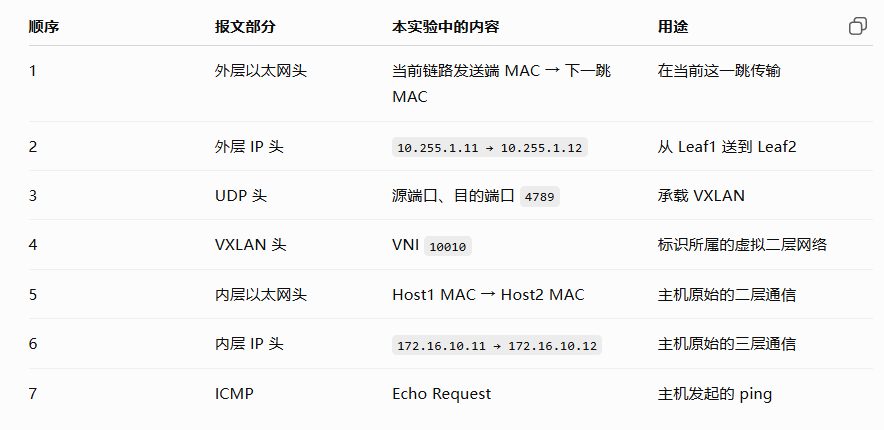
- ### 配置解析：

  - 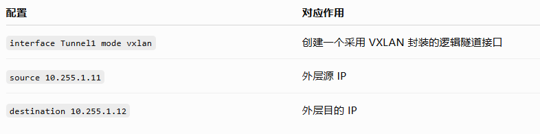
  - 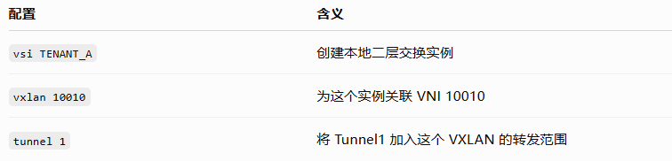
  - 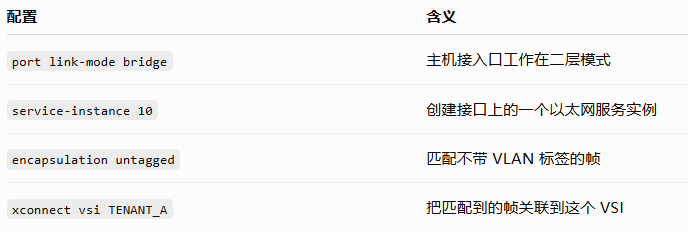
  - WGE1/0/3 收到无标签帧 → 服务实例 10 匹配 → 进入 VSI TENANT\_A → 对应 VNI 10010 → 必要时通过 Tunnel1 发往远端 Leaf
  - 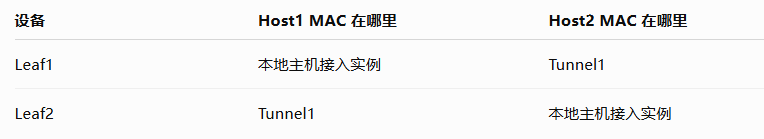
  - vsi:virtual service instance,虚拟服务实例，可以理解为虚拟的二层交换机

### 第四步：EVPN（Overlay控制平面）

- EVPN是为了解决传统VXLAN中遇到的几个问题：

  - 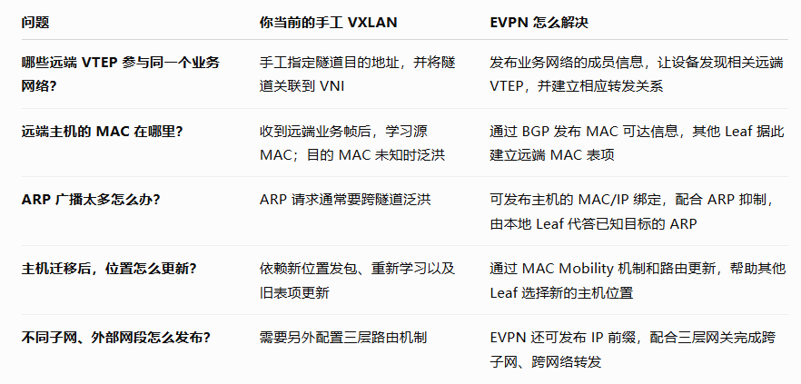
- 建立BGP邻居关系：

  - 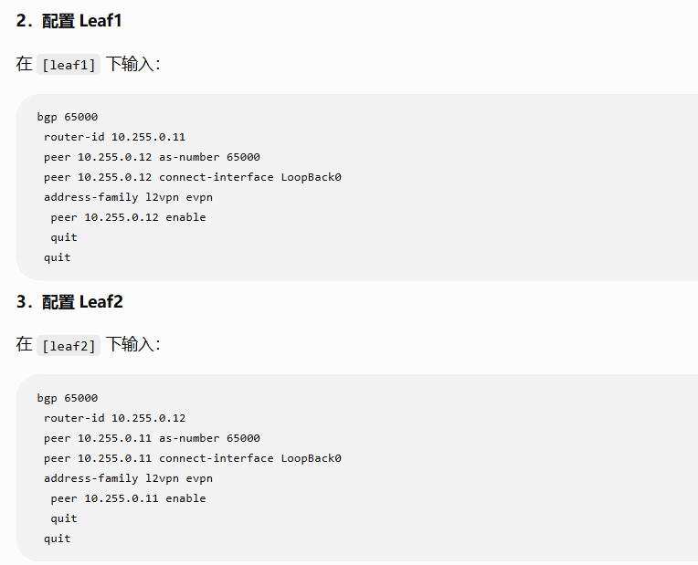
  - 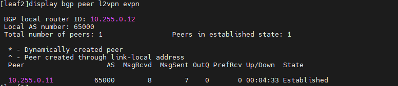
- 配置EVPN：

  - 移除原来的手工隧道：  
    ​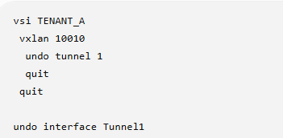
  - 配置VSI的EVPN参数

    - 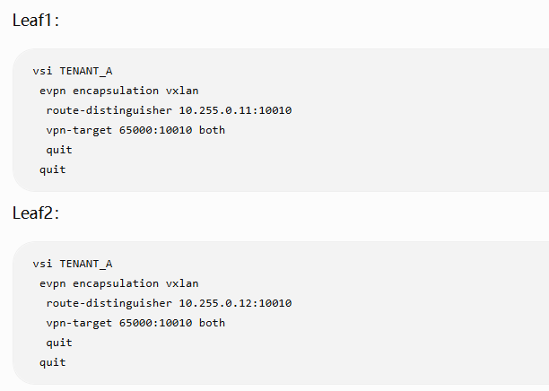
    - 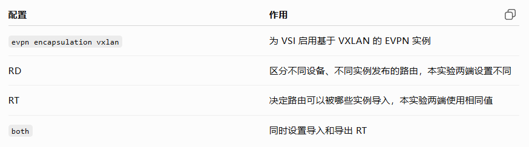
  - 关闭隧道侧的数据平面学习，通过EVPN控制平面学习

    - 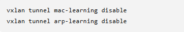
  - 主机发包，观察MAC路由：  
    ​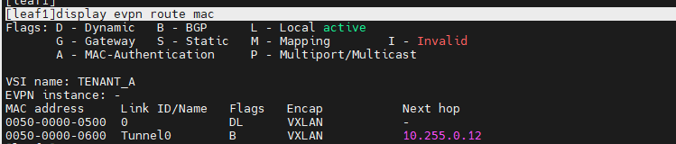
  - 可以看到，EVPN和MPLS VPN都是使用MP-BGP来进行交互，传递信息。

### 扩展：MP-BGP

- MP-BGP 就是“多协议扩展 BGP”：让 BGP 不仅能发布 IPv4 路由，还能发布 IPv6、VPN、EVPN 等不同类型的可达信息。它是在 BGP 上增加能力，不是一套完全独立的协议。
- MPLS L3VPN：给客户加上VPN身份，引入RD，RT；MPLS负责携带VRF标签
- EVPN：进一步用BGP发布以太网相关的可达性信息,**EVPN并不是VXLAN专属的协议**

  - Type 2:MAC/IP Advertisement

    - leaf2在本地发现host2，并把本地MAC转换为type2路由
    - leaf1收到路由后，变成可用于转发的mac表项
    - 但是，leaf知道了，并不代表host知道了mac地址，仍然会发送ARP请求

      - ARP抑制：让leaf在**知道答案的时候，直接回答本地主机**，减少ARP请求跨越VXLAN网络泛洪；

        - 在vsi视图下使用arp suppression enable开启即可  
          ​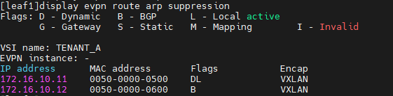
    - 同一台主机从leaf2搬到leaf1，evpn如何更新位置

      - 短时间可能存在两个发布者，都说明自己有host2

        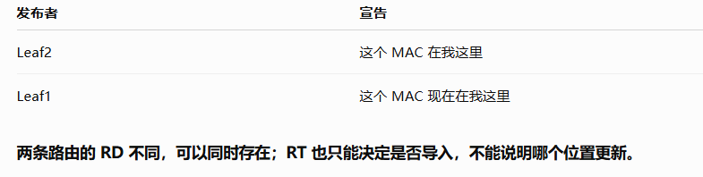
      - 通过**MAC Mobility序列号**解决更新问题，leaf会发布带有更高序列号的type2路由，从而表明自己的信息是更新的。
  - Type 3:IMET，用于建立流量的远端分发关系

    - RT匹配，导入远端成员关系
    - leaf1导入远端成员信息后，结合底层IP可达性，自动建立并关联了这个隧道

### 第五步：跨三层通信（overlay 三层网络）

- 刚才的实验都建立在，host1和host2在同一个二层网络里的基础上，如果改变host2的IP地址，使得不在同一个网络里，就需要网关进行三层通信
- host1发送查询：谁是我的网关172.16.10.1？，随后发出的帧：

  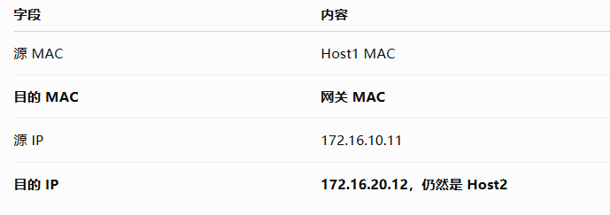
- 集中式网关：跨子网报文通过隧道送到集中式网关，由网关查IP路由，再送到目标网络

  - 优点：便于集中管理
  - 缺点：可能增加绕行，比如两个主机在同一个leaf上，但是仍然先到网关绕行回来；并且流量汇聚到网关
- 分布式网关：让leaf自己完成路由

  - 优点：就近转发，分散负载，方便主机迁移
  - 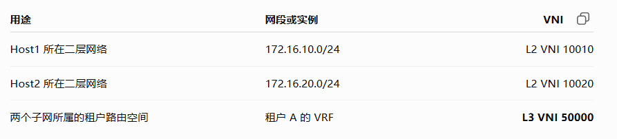
  - L3VNI让远端leaf知道，这份跨子网报文应该交给哪个租户的路由表；因为不同租户可能都有172.16.20.12，仅凭IP不足以确定查哪张表。**功能就类似于MPLS VPN中的内层标签**
  - 路由过程：

    1. host1把报文交给leaf1的网关
    2. leaf1第一次查路由：确定去哪个远端leaf
    3. leaf2第二次查路由：确定本地交付位置

#### 三层VXLAN实验：

1. 创建两端VRF

   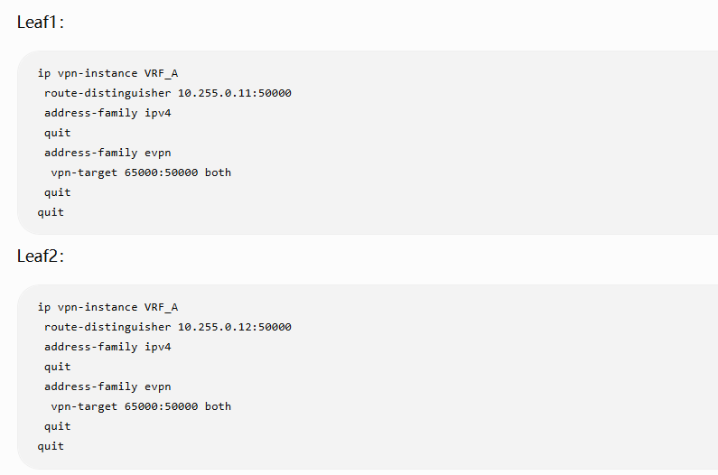
2. 创建L3 VNI接口

   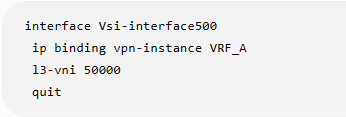
3. leaf1为原有网络增加网关

   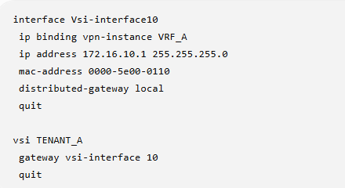
4. leaf2建立第二个二层网络和网关

   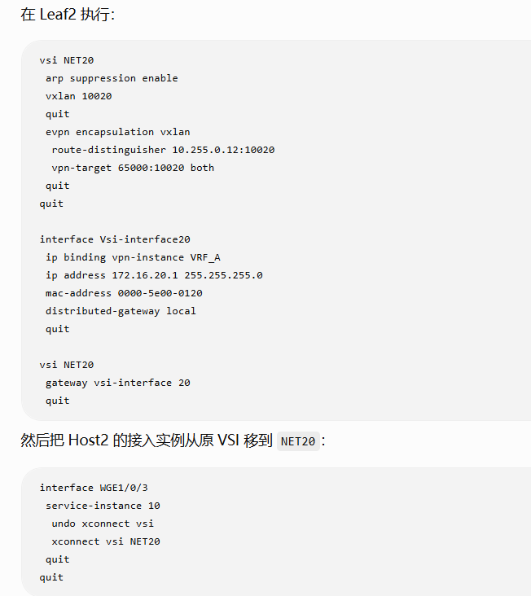
5. 修改主机地址和网关

   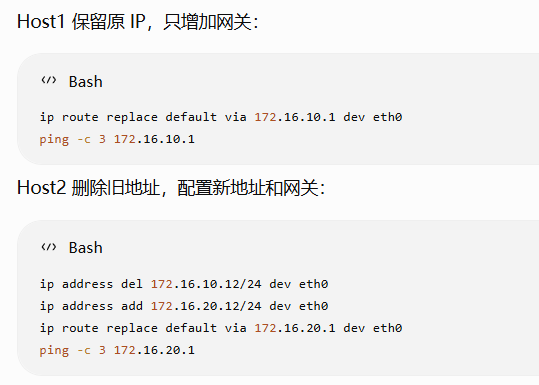
6. 结果：  
   ​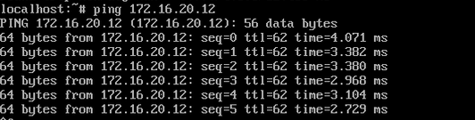

   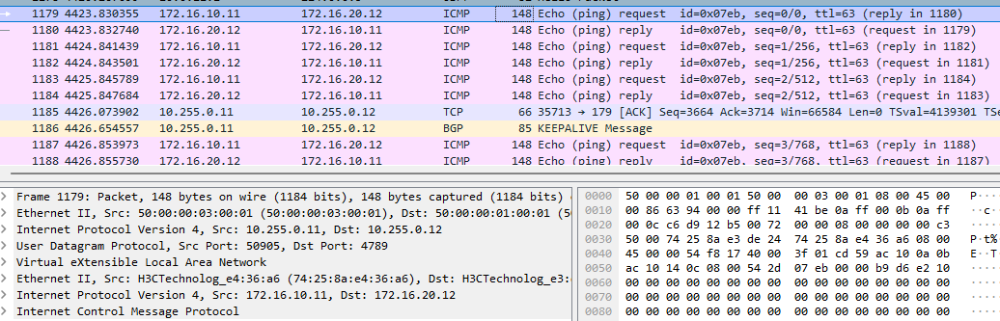

### 配置详解

- 把主机接入到网关,告诉vsi的gateway是vsi interface10  
  ​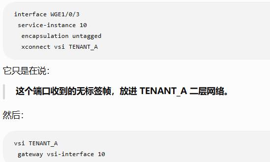
- 网关配置：给地址，并指定查哪张路由表

  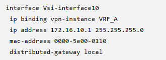
- VRF的RD和RT

  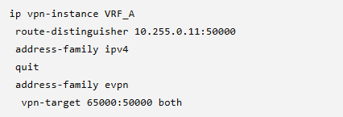
- vsi500：把vrf和l3 vni对应起来

  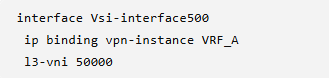

### 实验思考

- vsi存在，是因为leaf需要一个本地的二层交换空间，把主机接入口和VXLAN隧道接在一起，并在里面学习MAC、转发和泛红；

  类比传统交换机，就是创建vlan10，把接口加入vlan10

  **VSI 没有发明一种全新的交换原理，它把在 VLAN 中已经使用的“独立二层交换空间”显式地表达了出来。**
- 传统的VXLAN可以归纳为：创建隧道，创建vsi，绑定隧道，绑定vni，在接口下绑定到特定的vsi；
- EVPN 自动发现业务网络的远端成员，建立隧道转发关系，并把远端 MAC 学习从数据平面转到 BGP 控制平面。
- **ADDC：通过 GUI 描述网络和业务需求，由 AD-DC 自动完成对应的配置部署。**
- 当前的“对称 IRB、跨子网、跨 Leaf”通信中，Leaf 之间的这份 VXLAN 报文使用 L3 VNI，不再同时携带 L2 VNI。

‍